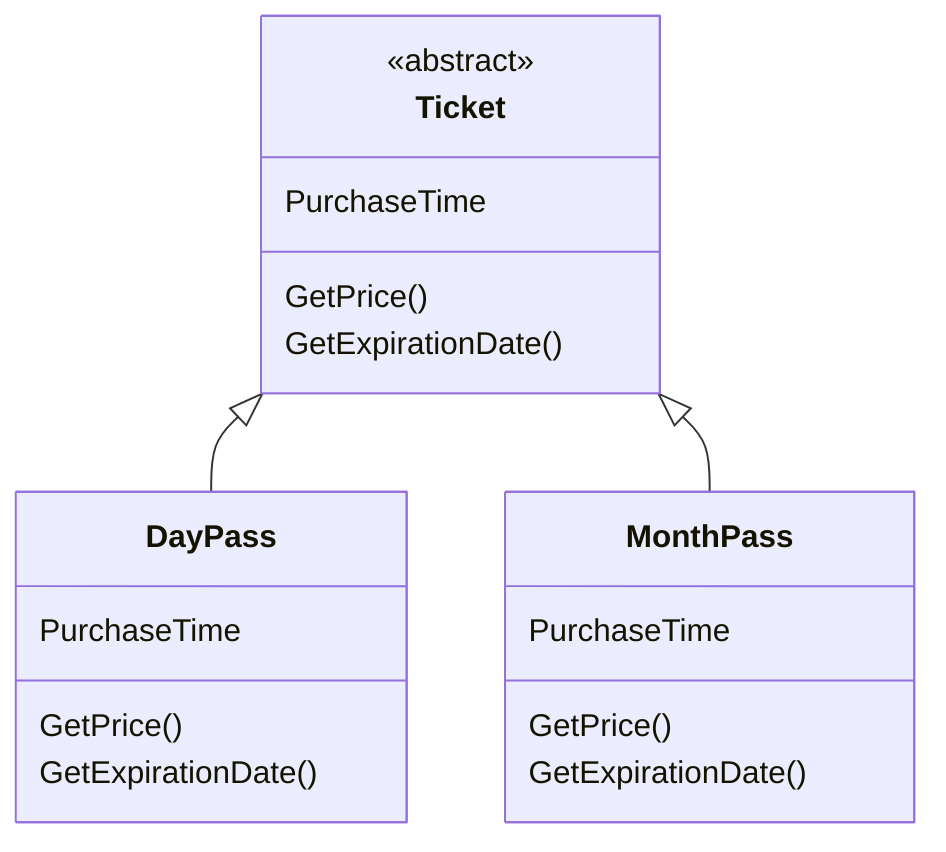
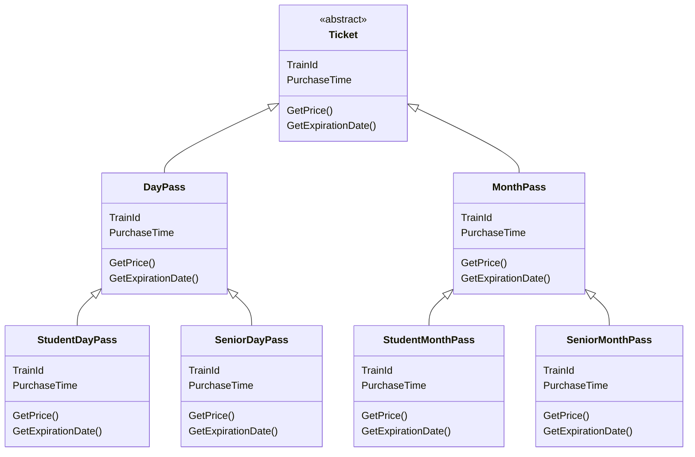
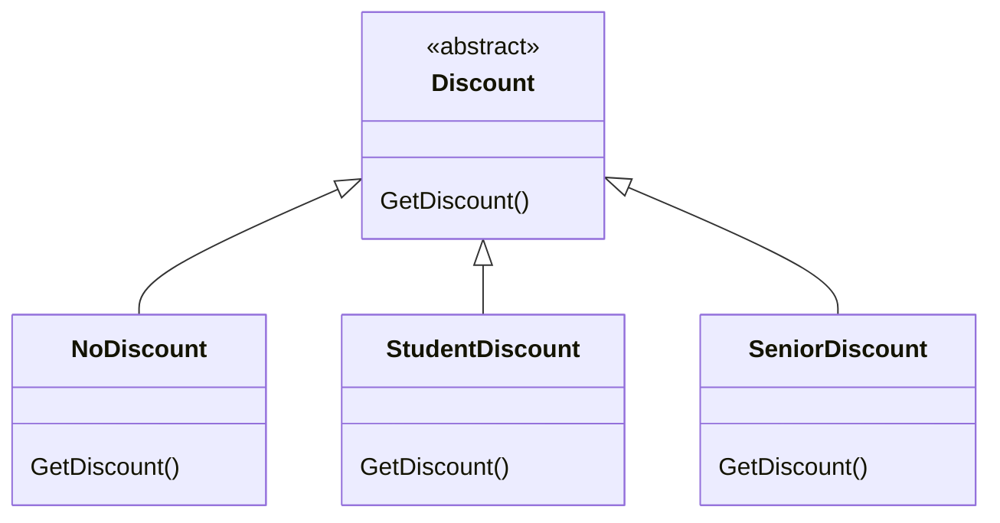
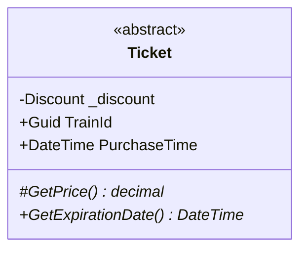
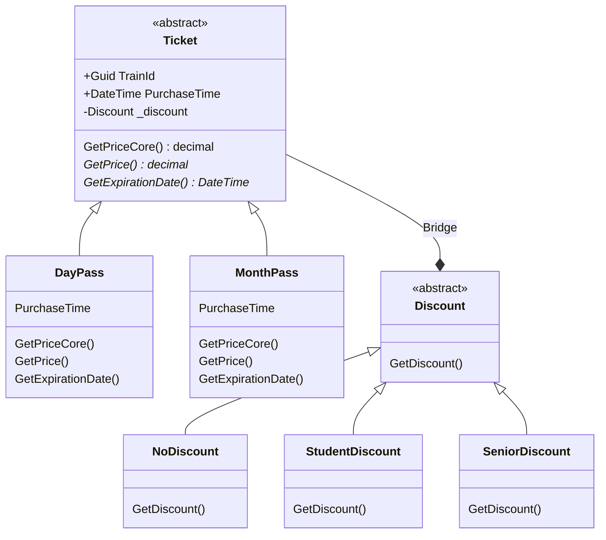
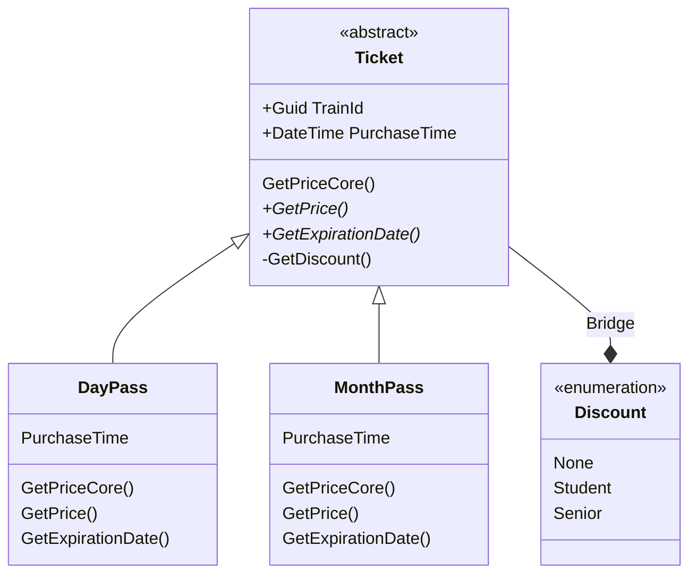
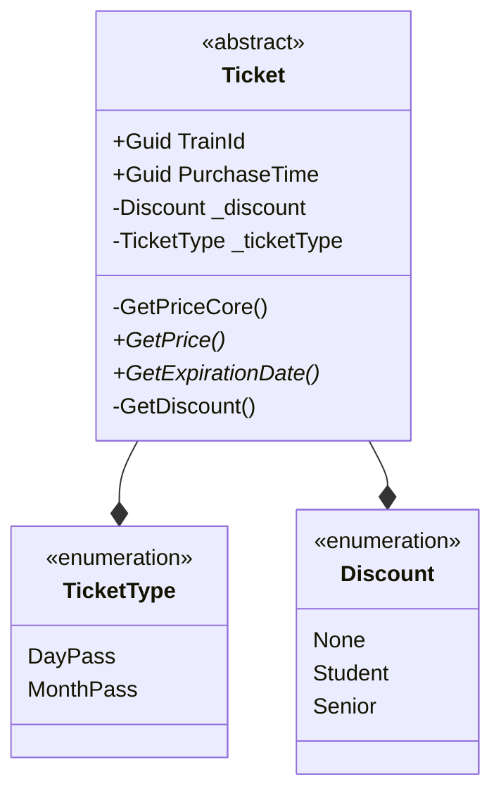

# Design Patterns: Bridge

Formal definition from "gang of 4":
"it's purpose is to decouple an abstraction from its implementation, so that the two can vary independently"

What are abstraction and implementations?

Code smells for this pattern
- Not following DRY principle / code duplication
- Got a big class heirarchy with lots of inheritance

# Example
Say you're building a ticket system with two types of tickets

You now have new requirements you need to add discounts for students and seniors.
A naive way to approach this is to simply add subclasses to each type of ticket, as follows:

Where in the student and senior subclasses we simply overridge the `GetPrice()` methods to apply the discount.

### The problem
The new requirement has meant we have added four more classes to the existing heirachrchy.
This presents a problem because if we wanted to add further discounts say we would have to add even more subclasses.
We began with 2, and now it's 6.
If we had another requirement, using this approach we'd have to add another say 3 classes to each subclass. We'd then have 18 classes in total. 
As you can see these numbers are getting exponentially bigger.
This exponential growth of complexity is exactly what we want to avoid.

Another problem you can is the duplication of business logic.
In the `StudentDayPass` and `StudentMonthPass` classes overrided `GetPrice()` method would be exactly the same; applying the exact same discount.
You'd have the same thing for the senior discount classes. 

### The Bridge patteren
The bridge pattern here tells use we should split the heirachy into two.

To do this we are going to move all discount related functionality to a different heirarchy.

We now add discount to as a argument for the abtract class `Ticket`.

We can now refactor this a little.
We rename `GetPrice()` to `GetPriceCore()` which only gets the original price of the ticket. We then write a new `GetPrice()` method will calculate the discounted price using `GetPrice()` and the `_discount` property.
Since `GetPriceCore()` is only used by dervied classes of `Ticket` it means we can set it to `protected` instead of `private`.

<!-- Put this somewhere where it's appropriate -->
Also note that `GetPrice()` and `GetExpirationDate()` are abstract methods.

This now gives us the following stucture:

Not that the arrow between `Ticket` and `Discount` is different; it is the arrow for composition.
This is what acts as the "bridge" between the two heirarchies.

If we now look at the structure we have now.
First thing to note is that we dont violate the DRY principle.
All the business logic to calculate the discounts are found in once place - the derived classes of discount - instead of it being repeated multiple times like before.

Also, we can see that this structure, and by extension that code that follows from this, would be much simplier.
We have 5 concrete classes as opposed to the 6 we had before.
But more than this, we can now add more types of discount without expoentially increasing the total number of classes.
Say for example we had 5 licenses and 5 discounts
using our previous approach we would have gotten

5 licenses * 5 discounts = 25 concrete classes

But using the bridge pattern:

5 licenses + 5 discounts = 10 concrete classes

We can clearly see that the bridge pattern drastically reduces the number of concrete classes required.

This is the crux of this pattern, it replaces complexity multiplication with complexity addition. Thus it brings under control the expoential growth of complexity.

## Recap 
<!-- TODO: Break this into it's own article -->
Complexity is a function of coupling.
COupling: the number of connection between elements in your code

The larger the number of connetions that greater the complexity.

<!-- TODO: Need to fill in -->

A better way to define the bridge pattern:
> It's purpose is to split a class hierarchy through composition to reduce coupling.

## How to handle class heirarchies

## Alternative implemetantion of bridge

Although we have refactored in the example above we dont need to stop there. 
There is still some code duplication that we can refactor out, and we can do this by getting of the inheritance and refactoring towards composition.

First, note how in each concrete discount class essentially does the same thing.
What we can do here is instead is make discount an enumeration over all the different types of discount. Then move the logic of the discount into a `GetDiscount()` method in `Ticket`.
In this method you could simply have a switch statement that based on the value of `_discount` would decide what discount to give.

<!-- Need to check these class diagrams put in times and access modifieers and make sure they're correct because they change, and this has been missed. -->

We dont have to stop here though.
You can see that `DayPass` and `MonthPass` are also very similar.
This means we can convert them to a `enum` too.

We would also have to do what we did before, we need to inject this `enum` into the `Ticket` constructor.

Further we can now remove `GetPrice()` and replace it with `GetBasePrice()` to contain the business logic for the ticket prices.
It would simply contain a switch statement containing all the prices based on the value of `_licenseType`.
We can also refactor `GetExpirationDate` to check the value of `_licenseType` and then have a switch statement return the correct date (making use of `PurchaseDate`). e.g. for a `DayPass` to simply have to do `PurchaseDate + 1`.
For a month, `PurchaseDate + 30`.

Doing this then allows us to get rid of the concrete classes for `DayPass` and `MonthPass`

### Summary
- Replaces inheritance with composition
- Moved all business logic to the base class

There's a key point here "prefer composition over inheritance"

## Why composition over inheritance
- Composition is more flexible than inheritance
  - Easier to change behavior on the fly by injecting the behavior where you like
  - Inheritance is rigid - usually because most programming languages let you inherit from one type
- Composition is easier to understand
  - Because you can see everything that's going into the class, which is much easier than trying to figure out the class hierarchy
