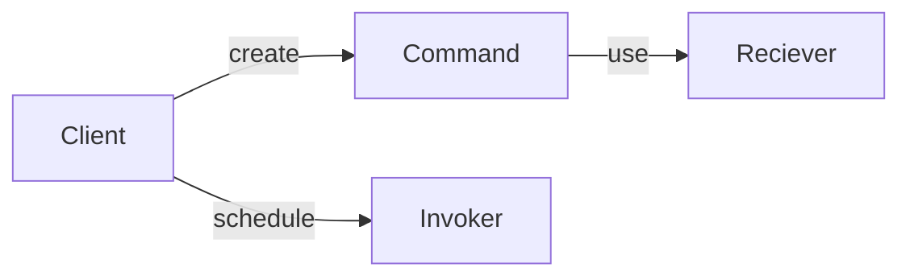
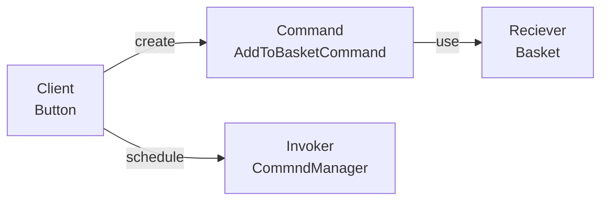

# Design Patterns: Command

## Characteristics
1. Command
   1. Holds instructions and reference to things that need executing
2. Reciever
   1. What the command will execute
3. Invoker
   1. Is what we use to invoke commands
   2. Keep track of executed commands
4. Client
   1. Decides which command to schedule for execution.



A command object contains all the data to process the request now or at later timer.

## Example

Consider the following IRL example



`AddToBasketCommand` it will contain:
- reference to produce to be added
- the shopping basket
- a way to check stock availability

it contains all the pieces for the command to be executed.
As well as a way to check if the command should be executed or not. Here if the item is not in stock then this command cannot be executed.

Since the command manager keeps track of all commands executed. This means the command pattern can easily be leveraged to introduce undo or redo functionality.

## Implementing the command pattern

Take the follow example

```
ShoppingBasket
| Program.cs
ShoppingBasket.Business
| Models
| Repositories
```

```cs
// ShoppingBasket.Program

class Program
{
    static void Main(string[] args)
    {
        var shoppingBasketRepository = new ShoppingBasketRepository;
        var productsRepository = new ProductsRepository;

        var product = productsRepository.FindBy("bwb43hf");

        shoppingBasketRepository.Add(product);
        shoppingBasketRepository.IncreaseQuantity(product.ItemId);
        shoppingBasketRepository.IncreaseQuantity(product.ItemId);
        shoppingBasketRepository.IncreaseQuantity(product.ItemId);
        shoppingBasketRepository.IncreaseQuantity(product.ItemId);
        shoppingBasketRepository.IncreaseQuantity(product.ItemId);

        PrintBasket(shoppingBasketRepository);
    }
    
    static void PrintBasket(ShoppingBasketRepository shoppingBasketRepository)
    {
        // Code to print items in basket
    }
}
```

Here we have an application that access that accesses the shopping basket and products using the [repository pattern](repository.md).
It finds one of the products by Id and then add's increases the quantity of that item five times.
It then finally prints the content of the basket which should be five times the item with Id `bwb43hf`.

We want to apply the command pattern here because we dont want to interact with repository here in the application.
Instead what we want is a layer that'll handle all dealing with the repo and then we can simply call that from wherever in the application.
The first thing we need to do is create a command interface, this is a contract of how would command manager will interact with our command.

Lets first add a folder called commands

```
ShoppingBasket
| Program.cs
ShoppingBasket.Business
| Commands
| Models
| Repositories
```

We have the command interface.
```cs
// ShoppingBasket.Buisness.Commands.ICommand

interface ICommand
{
    void Execute();
    bool CanExecute();
    void Undo();
}
```

We now introduce our command manager, since this command manager is quite general we dont need to call it something like `ShoppingBasketCommandManager`. It'll allow use to execute any type of command.

```cs
// ShoppingBasket.Buisness.Commands.ICommand

public class CommandManager
{
    private Stack<ICommand> commands = new Stack<ICommand>();

    public void Invoke(ICommand command)
    {
        if (command.CanExecute())
        {
            commands.Push(command)
            command.Execute();
        }
    }

    public void Undo()
    {
        while (command.Count > 0)
        {
            var command = commands.Pop();
            command.Undo();
        }
    }
}
```

Here we have introduce a `stack` to keep track of all the commands we've used. We chose to use a `stack` because we want to use a "Last In First Out" (LIFO) data structure as it'll allow us to keep track of the exact order the commands were executed.

There are two public methods that allow us to interact with the `CommandManager`.
The `Invoke` method which we will use to invoke our command. It works by simply checking if the command can be executed and if it can adding it to the stack of commands and executing it.
We also have the `Undo` method which will allow us to undo the last command.

We can now add the `AddToBasketCommand`.

```cs
// ShoppingBasket.Business.Commands.AddToBasketCommand

public class AddToBasketCommand: ICommand
{
    private readonly IShopppinhBasketRepository _shoppingBasketRepository;
    private readonly IProductRepository _productRepository;
    private readonly Product _product;

    public AddToBasketCommand(
        IShoppingBasketRepository shoppingBasketRepository,
        IProductRepository productRepository,
        Product product
    )
    {
        _shoppingBasketRepository = shoppingBasketRepository;
        _productRepository = productRepository;
        _product = product;
    }

    public bool CanExecute()
    {
        if (product == null) return false;

        return productRepository.GetStockFor(product.ItemId) > 0;

    }

    public void Execute()
    {
        if (product == null) return;

        productRepository.DecreaseStockBy(product.ItemId, 1);

        shoppingBasketRepository.Add(product);
    }

    public void Undo()
    {
        if (product == null) return;

        var lineItem = shoppingBasketRepository.Get(product.ItemId);

        productRepository.IncreaseStockBy(product.ItemId, lineItem.Quantity);

        shoppingBasketRepository.RemoveAll(product.ItemId);
    }
}
```

We have a constructor that take in interfaces for our `ShoppingBasketRepository` and `productBasketRepository`.
This means we aren't tied down to any concrete implementations, except for product which is oly a simple model.
This means we can easily use different implementations for say our shopping basket repository and this code shouldn't be affected.
Also, doing this is helpful when testing, because we can easily use mocks of the repositories when creating a command to test.

Before we can refactor our application to use the command design pattern,
we also need to create another command for adding and removing items to the basket.

```cs
// ShoppingBasket.Business.Commands.ChangeQuantityCommand

public class ChangeQuantityCommand : ICommand
{
    public enum Operation
    {
        Increase,
        Decrease
    }

    private readonly Operation _operation;
    private readonly IShoppingBasketRepository _shoppingBasketRepository;
    private readonly IProductRepository _productRepository;
    private readonly Product _product;

    public ChangeQuantityCommand(
        Operation operation,
        IShoppingBasketRepository shoppingBasketRepository,
        IProductRepository productRepository,
        Product _product,
    )
    {
        _operation = operation;
        _shoppingBasketRepository = shoppingBasketRepository;
        _productRepository = productRepository;
        _product = product;
    }

    public void Execute()
    {
        switch (_operation)
        {
            case Operation.Decrease:
                _productRepository.IncreaseStockBy(_product.ItemId, 1);
                _shoppingBasketRepository.DecreaseQuantity(product.ItemId);
                break
            case Operation.Increase:
                _productRepository.DecreaseStockBy(_product.ItemId, 1);
                _shoppingBasketRepository.IncreaseQuantity(product.ItemId);
                break
        }
    }

    public void CanExecute()
    {
        switch (_operation)
        {
            case Operation.Decrease:
                return _shoppingBasketRepository.Get(product.ItemId).Quantity ! = 0;
            case Operation.Increase:
                return (_shoppingBasketRepository.GetStockFor(proudct.ItemId) - 1) >= 0;
        }
    }

    public void Undo()
    {
        switch (_operation)
        {
            case Operation.Decrease:
                _productRepository.DecreaseStockBy(_product.ItemId, 1);
                _shoppingBasketRepository.IncreaseQuantity(product.ItemId);
                break
            case Operation.Increase:
                _productRepository.IncreaseStockBy(_product.ItemId, 1);
                _shoppingBasketRepository.DecreaseQuantity(product.ItemId);
                break
        }
    }
}
```

We now have all the commands we need in order to refactor our application,
with the aim of getting rid of the parts that are acting with the shopping cart directly.

We will now use our command manager and concrete commands as follows.

We want to replace the line that add the product to the basket repository
and the 5 lines that add the item to the basket.

To do this we create instances of out commands and then replace the lines

```cs
// ShoppingBasket.Program

class Program
{
    static void Main(string[] args)
    {
        var shoppingBasketRepository = new ShoppingBasketRepository;
        var productsRepository = new ProductsRepository;

        var product = productsRepository.FindBy("bwb43hf");

        var addToBasketCommand = new AddToBasketCommand(
            shoppingBasketRepository,
            productsRepository,
            product
        );

        var increaseQuantityCommand = new ChangeQuantityCommand(
            ChangeQuantityCommand.Operation.Increase,
            shoppingBasketRepositorym
            productsRepository,
            product
        );

        var manager = new CommandManager();

        manager.Invoke(addToCartCommand);
        manager.Invoke(increaseQuantityCommand);
        manager.Invoke(increaseQuantityCommand);
        manager.Invoke(increaseQuantityCommand);
        manager.Invoke(increaseQuantityCommand);
        manager.Invoke(increaseQuantityCommand);

        PrintBasket(shoppingBasketRepository);
    }
    
    static void PrintBasket(ShoppingBasketRepository shoppingBasketRepository)
    {
        // Code to print items in basket
    }
}
```

The above shows the conversion from using the `shoppingBasketRepository` directly into using the commands with the `CommandManager`.

What's interesting is that now our application doesn't actually have to know how to interact with the datastore. 
It's up to the command to communiate with the reciever.

This demonstrates the command design pattern. 
It adds a little more complexity which might nore always be desired, as well as another layer to keep track of in our application.

Summary:

The command pattern consists of
    - a command
    - the reciever
    - invoker
    - client
A command contains all the information it neesd to execute now or at a later time

Using the command design pattern hwe have an additional layer in our application whihc allows us to process certain data and instructions, this makes the application more robust as well as more testable.

Allows for seperation of concerns - our application is seperate from our repositories and data layers

One of the drawbacks of this pattern is that it may add unnecessesary complexity.

