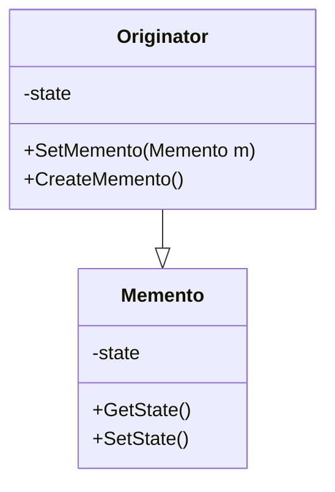
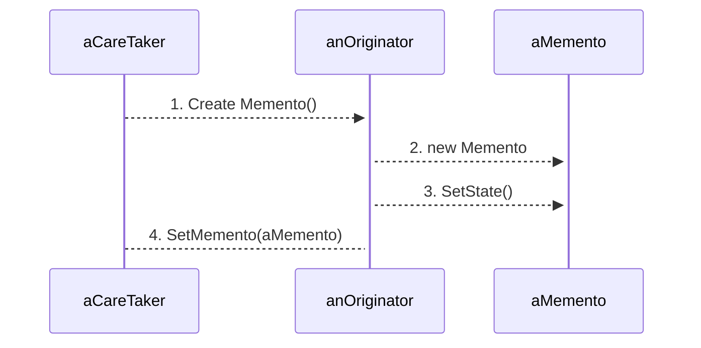

# Memento Design Pattern

The aim of it is to implement undo and redo functionality or otherwie managing the state of objects.

## What is the momento pattern?

A momento holds an objects internal state so the object can be restored to this state later.

AKA the token pattern
You could think about a momento as a save point in a game or a particular commit in source code.

## Examples of where it's applied
- save states in games
- Supporting undo operations e.g in an drawing application
- Rolling back a distributed transaction
  - similar to the above case  but involves mulitple systems with their own state.

## What problem does the momento pattern solve?

Any time you need the ability to role back an object to its previous state.

If your application has undo functionality.
It's very likely the memento pattern is a good fit here since  this pattern allows you to add functionality without adding a lot of additional responsibility to the existing objects.
Thus making sure you adhere to the [single responsibility principle](../../solid/solid_explained/srp.md).

When using primitive types like strings where it would be easy to undo, this pattern might be overkill
However, for complex objects where trying to role back a state would require exposing the internal state to external collaborators - this would break encapsulation - hence it would be a good idea to use the momento pattern.
The momento pattern allows you to capture the internal state of an object without violating [encapsulation](../../encapsulation.md) or the [single responsibility principle](../../solid/solid_explained/srp.md)

## WHat is the structure of the momento pattern?

There are three parts to this design pattern.

### 1. The Originator
The object who's state is being tracked e.g. a document or game

2. The Caretaker
The external object that works with the originator e.g. the UI a console app etc.
It's the caretakers job to perform opertions on the originator as well as manage the Originators state.

3. The Memento
This is the key to this design pattern. What we are going to do is factor out the state of the Originator to it's own object.
The Memento will hold the internal state of the originator e.g. the state of a game or document.

It has to be the complete state of the orignator so that the origintor can be restored completely to a previous state using it.

Let's look at the classes

Note that the state is private, we want to keep this encapsulated and seperate from the rest of the application.
THe `setMemnto()` method is used to restore the `Originators` state.
`CreateMemento()` is fairly self explanatory, it allows you to create a memento from the current state of the object.

The `Originator` works directly with the momento, creating it, setting it's internal state and reading back that state too.

Ideally, access to the `Memento`'s state should be restricted to `Originator` to maintain it's encapsulation.

The `Caretaker` save the memento it e.g in memory or a persistent store if serialization is supported.
If there needs to be some way for the user to choose which memento to use or to organise the mementos this would fall to the caretaker to handle.

## How does it work?

When a user makes a request to save the state of the current system
The caretaker callls the orginator.
The originator, then create a new Memento and sets it's state.

Later when the user requests to restore the state of the system.
The caretaker calls the Originators SetMemento method passing in a memento.
Inside the `SetMemento` method,
the Originator retrieves the state of the Memento using it's `GetState()` method, and then updates its current state to what was in the Memento.

### When working with a Memento design pattern you should remember
the memento should be very simple.
It should have an internal state, and then methods to get and set that state only.

The originator must support methods to create and restore mementos.

The caretaker is responsible for managing previous states.

To preserve encapsulation, avoid giving the caretaker direct access to internal memento or originator state.

## Managing mementos in the caertaker.

One easy way of managing mementos in the caretaker is to use a stack.

We can see that state 1 was created and added to the stack when state 2 was created.
State 2 was added when state 3 was created.
And state 3 was added when state 4 was created,
with state 4 being the current state of the system.

If we wanted to restore the system it's previous state we simply take the last one in i.e. state 3 and make that the current state of the system.

In applications that only support undo there is no way to save state 4, it is only replaced by state 3.

From here the user can roll back further to state 2 or state 1.
Or can simply move forward and state modifying the current state thus creating a new state of the system.

Supporting redo is very easy once you have undo set up.
To set it up all you need to do is, instead of deleting the current state and replacing it with it's previous state, when you undo.
What you do, is save that state to a redo state.

Taking the previous example.
With the system in state 4 and we undo, we now move state 4 to the redo stack,
and make state 3 the new current state of the system.

This can be repeated if the user was to undo again.
State 3 would be pushed to the redo stack and state 2 would now be set as the current state.

If a user wants to redo, the reverse would happen.
State 2 would be pushed from the current state to the undo stack.
State 3 would be popped from the redo stack and would now be the current state of the system.

### Implementing undo and redo operations
When implementing these opertions you need to make sure that the caretaker does the following things.

- Store states (mementos) on an undo stack
- After each action, add new memento to undo stack
- On undo, pop previous memento from undo stack; add to redo stack
- On redo, pop previous memento from redo stack; add to undo stack.

Remember Mementos should be immutable objects with state but no behaviour.

## Steps to apply the Memento pattern
1. Follow [refactoring fundamentals](../../refactoring_fundamentals.md) to ensure you dont introduce bugs.
2. Regardless of if you have a state management system built in. You need to define a memento type.
Keep it as simple as you can and make sure it's accessors are only available to the originator to preseve encapsulation.
3. Add methods to the originator to save and restore state.
4. Create the caretaker
 Manage to menentos somewhere. Identify the class that will be responsible for this.
Create whatever structures you need to to store one or more mementos.

## Exaple
<!-- TODO: add code example -->

## REview

## Alternative approach: Reverse Operations

An alternative way you can implement undo/redo operations, is to use reverse operations.
All this simply means is instead of storing the entire state of the system, you just store the operation and the reverse operations that undoes it's effects.
To perform an undo, you apply the operation.

Works well with the [command pattern](command.md).

The downside of this approach is that the it only works with opposites that always return the original result.

An easy example to demonstrate this would be a calculator.
Say you start with 30.

You then add 5. This operation is stored.
And you get the result 35.

You then double it. This again is stored.
Returning the result 70.

Now say you want to undo.
You retrieve the last operation `*2` the reverse of this operation would be to divide by 2.
Applying this you get the result 35.

Wanting to undo again.
We do the reverse of the next operation in the stack, which is `+5`, which would be substract 5.
Applying this we get `30` once again.

This doesn't always work however if you dont have operations that reverse properly.

Starting with 30 again.
If we square it we get 900.

But now if we do the reverse of this operation, i.e square rooting it, we are left with two solutions 30 and -30.
So it's not clear what the reverse operation would be.

If you think we could just take the positive.
Then say we started with 30 substracted 45, leaving us with -15.
We then squared it to get 225.
Square rooting and taking the positive, gives us 15 and then adding 45 gives us 60 which is not the number we started with.

## Alternative approach 2: Storing Diffs

This alternative requires less space, you simply store the difference between previous state and the current state instead of storing the whole state.
This is how [version control systems](../../dictionary.md#vcs) like git work.

For small changes and especially if you don't have to have a long history of changes this method works quite well. 

There are two ways this way can be more resource heavy:
1. Creating a diff might reqiure more resources than simply making a copy of the current state
2. Restoring to a previous state might result in having to apply mutiple diffs in succession, which could be more resource intensive.

## Related Patterns

[command pattern](command.md)
provide reversal commands to undo operations.

The command pattern may be used as an alternative to storing full states.
Instead of the caretaker handling managing states, it manages a series of commands.
When the user wants to revert to a previous state, reverse commands are applied. As shown in the calculator example.

[Iterator pattern](iterator.md)
In the case of iterators, individual iterations sometimes need to store state.
THese can leverage the memento pattern keeping this logic out of the interator itself.

## Key Takeaways

Memento Design Pattern:
- A memento stores the state of an originator object
- Removes state management from originator to caretaker.

Common uses:
- Game save points
- Undo support
- Undo/Redo support

Key Pricnples:

- Enforces SRP by removing state management as a responsibility
- Avoids breaking encapsulation by keeping the originator's internal state safe from prying eyes.