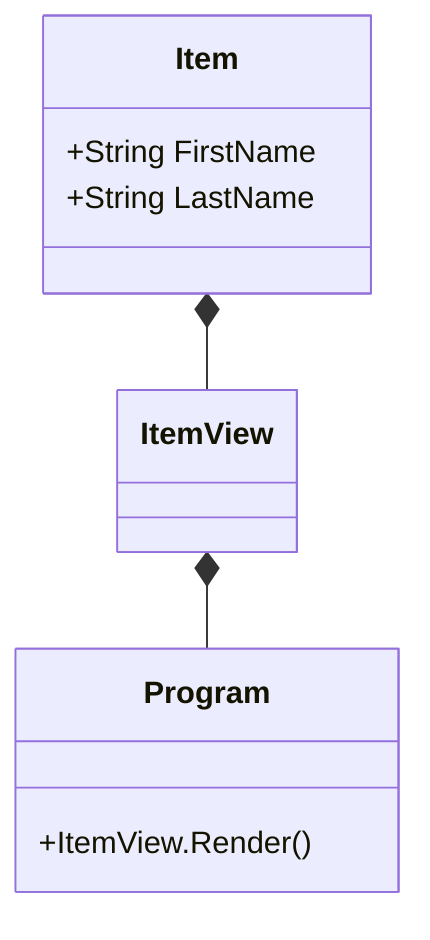
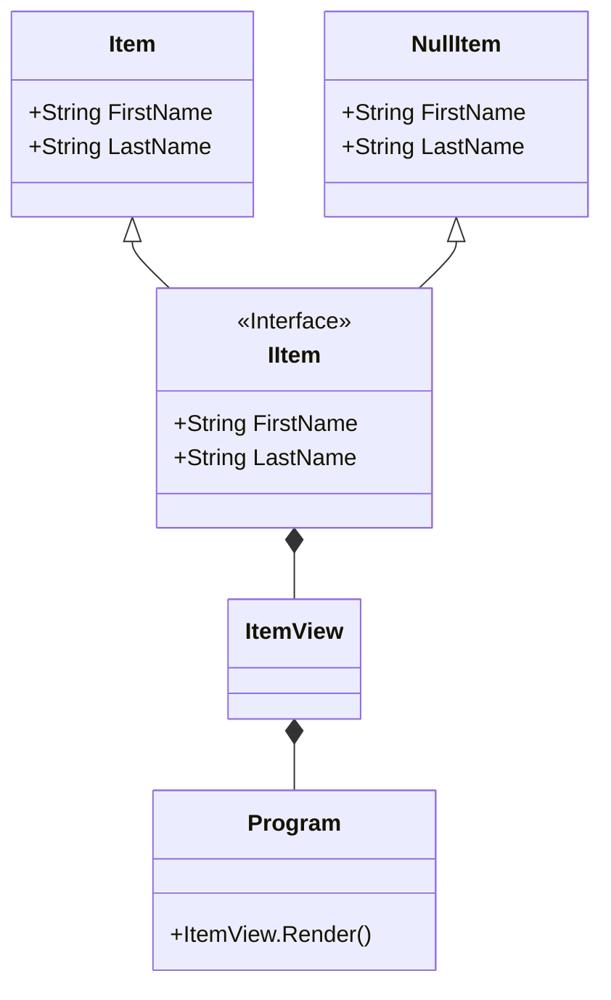

# Design Pattern: Null Object

Purpose?
With this pattern you can stop writing null checks and do so safely.

# The problem to solve
Consider the following code:

```cs
public class ItemView
{
    public ItemView(Item item)
    {
        if (item == null) throw new ArguementNullException();

        # do some stuff
    }
}
```
This is a very common check whenever you're receiving a nullable arguement.
The problem with this null check is that it increases cyclomatic complexity.

Cyclomatic complexity - a measure of the number of logical branches are in your code.

The code above has a cyclomatic complexity of 2.
Imagine if we had several null checks?
Or complexity would drasticall increase!
Even though we haven't actually done anything yet.

The program calling `ItemView.Render()` may not know that the `ItemView` has not been initialised. This ia an easy way a null reference error can be thrown.



Now imagine we had a `NullPerson` class which we could use instead of setting `PersonView` to null.

Since `NullPerson` and `Person` are botha type of person we can create an `IItem` interface for them.



It is common practice to add `Null` as a prefix for the null object.

Here the null person would just provide a default implementation.

If we have implemented the null object pattern for our code above it means we dont have to worry about a null check since person is not nullable

```cs
public class ItemView
{
    private readonly IItem _item;

    public ItemView(IItem item)
    {
        _item = item;
    }
}
```
Here we can see we have a cyclo complexity of 1, and our code is now much cleaner.

# Summary
- Use Null Object to avoid null checks
- Returned object is not null
- Use interface or inheritance as appropriate
- Cleaner code