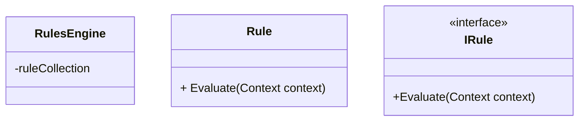

# Rule Engine Design Pattern

## What is the Rules Engine Pattern

A rules engine processes a set of rules and applies them to produce a result.

A rule describes a condition and may calculate a value.

Rules are grouped together into collections for use in rules engines.

Different approaches utilize rules in different ways.
They might apply rules 

Rules engine is best applied when you need to refactor code.

## Situtations where Rules engines migh tbe applicable
- Scoring games
  - Thye have rules that determine score, which works with the rule engine wel
  - Can also be used to determine a score for games that dont use traditional score keeping
- Calculating discounts
  - Especially helpful because overtime discounts can become very complicated 
- Diagnosing health concerns
  - Able to make good decisisons?
 
## What software design principles apply

Rules engine allows us to adhere to the [open-closed principle](../../solid/solid_explained/ocp.md).
Because it allows us to add behaviour by creating new classes instead of modifying old ones.


## Appliying the rules engine pattern

The key to refactoring a large complex class is by first singling out indidual cases. 
Try to make these case as practical.
This doesn't mean as small as possible, but each shoudl at least follow the [single responsibility principle](../../solid/solid_explained/srp.md).

Rules are managed using a rules engine, which calculates the result from a collection of rules and chooses which rules to apply.
This will be the rules engine class.

You need to understand how your rules are evaluated.
Sometimes it's only the first rule that matches a condition is the only one needed.
Other times it may require evaluating lots of conditions and then agregating the result.
There are also times when the order of rules matters.
These are all things you need to take into consideration.

## Example

Say you're setting up the discount functionality for a e-commerce site.

YOu have a class which gives you some information about the customer

```cs
public class Customer
{
    public DateTime? DateOfFirstOrder { get; set; }

    public DateTime? DateOfBirth { get; set; }

    public bool isStudent { get; set; }
}
```

You also have a class that calculate the discount 

```cs
public class DiscountCalculator
{
    public decimal CalculateDiscountPercentage(Customer customer)
    {
        if (!customer.DateOfFirstOrder.HasValue)
        {
            return 0.15m;
        }
        else 
        {
            if (customer.DateOfFirstOrder.Value < DateTime.Now.AddYears(-10))
            {
                return 0.15m;
            }
            if (customer.DateOfFirstOrder.Value < DateTime.Now.AddYears(-5))
            {
                return 0.10m;
            }
            if (customer.DateOfFirstOrder.Value < DateTime.Now.AddYears(-2) && !customer.isStudent)
            {
                return 0.05m;
            }

            if (customer.isStudent)
            {
                return 0.2m;
            }

            if (customer.DateOfBirth < DateTime.Now.AddYears(-70))
            {
                return 0.10m;
            }

            return 0;
        }
    }
}
```

If we check the [cycolomatic complexity](../../cylomatic_complexity.md) of the code above, we will see that it would be very high.
This is because there are many different paths to a return value.
It's generally accepted that you dont want to exceed a cyclomatic complexity of 10.
<!-- TODO: maybe add this bit to cyclomatic complexity document -->

<!-- TODO: read ardalis.com/measuring-aggregate-complexity-in-software-applications -->
   
Now consider you get a new set of functionality.
Customers get 15% off on their birthdays.
Loyal customers (5+ years) get an extra 10% on top of any birthday discount.


```cs
public class DiscountCalculator
{
    public decimal CalculateDiscountPercentage(Customer customer)
    {

        var isBirthday = customer.DateOfBirth.HasValue && 
            customer.DateOfBirth.Value.Day == DateTime.Today.Day &&
            customer.DateOfBirth.Value.Month == DateTime.Today.Month&&
            customer.DateOfBirth.Value.Year == DateTime.Today.Year;

        if (!customer.DateOfFirstOrder.HasValue)
        {
            return 0.15m;
        }
        else 
        {
            if (customer.DateOfFirstOrder.Value < DateTime.Now.AddYears(-10)  || isBirthday ) // Added in isBirth here to add the birthday discount 
            {
                if (isBirthday) return 0.25m // Added 10% additioal discount for loyal customers
                return 0.15m;
            }
            if (customer.DateOfFirstOrder.Value < DateTime.Now.AddYears(-5))
            {
                if (isBirthday) return 0.20m // Added 10% additioal discount for loyal customers
                return 0.10m;
            }
            if (customer.DateOfFirstOrder.Value < DateTime.Now.AddYears(-2) && !customer.isStudent)
            {
                return 0.05m;
            }

            if (customer.isStudent)
            {
                return 0.2m;
            }

            if (customer.DateOfBirth < DateTime.Now.AddYears(-70))
            {
                return 0.10m;
            }

            return 0;
        }
    }
}
```

If you check the cyclomatic complexity of this method, it's a lot higher.

As we can see the `DiscountCalculator` keeps growing as we add additional discount rules.
We can assume that this will only grow in the future as more rules may be added.

Generally, we dont want methods that are so long we have to scroll down to be able to read them.
Additionally we don't want methods that are very high in cyclomatic complexity, keeping in mind that rule of thumb of 10.

As additional changes keep coming in, we are having to continusously modify this code in order to keep up.
This violates the open/closed principle mentioned earlier.

## What is the structure of the rule engine pattern

### The parts

1. The Rules collection
These is a group of all the rules, 
where each rule defines how the system should behave under certain conditions.

2. Rules Engine
The rule engine is the one responsible for applying the correct rules in a given situation.

3. System Input
In order for us to apply the rules we require input from the system regarding its state/context.


### The structure

start with the rules engine, holds a collcetion of individual rules.
This collection may be created within the engine itself when it is constructed.
Alternatively, it can be passed in or populated using a technique like [reflection](../../reflection.md).

Each rule has a method that allows you to evalue it e.g. `Evaluate()`, which is defined in a base class or interface e.g. `IRule`
The `Evaluate()` method might take in some context as input (shown below),
or rules maybe cre\ted with context passed in at construction time, so there's no need for a context arguement. Or the context might be available globally so the context doesn't need to be passed in.



## When working with rules remember
- Keep individual rules simple.
That;s the whole point of this pattern it allows us to model very complex problems as a set of smaller rules.
- As the rules grow in complexity, allow for more complex rules to be from a combination of smaller ones.
- You need to decide how rules will be applied
    Will they be combined on on top of the other, or is only a maximum value to be returned?
    Or will it simply return with the result of the first condition met?
- As you design your rules, consider whether rule ordering will matter in the evaluation.

Once you've defined some rules, you can then put their evaluation into its own type - the rules engine.

Normally, the rules engine
- Accepts the collection of rules in its constructor
- Allows of adding or removing rules or swapping out sets of rules. This is very helpful if you provide a way for the user to modify what rules are in use.
- Apply the rules to a given context or system state
- In the evaluate method, you need to return the correct result either by choosing the appropriate rule to be returned or an aggregate of applicable rules.

## Steps to apply the rules engine
1. Have tests
This is key to refactoring in general, but having tests means that you are able to make all the changes you want and still be able to check that your program is working as you it should.

2. Rememeber refactoring doesn't change what the program does only how it' organised.

3. A nice way to approach this refactoring would be to first extract methods for individual conditions.
Once you've done this you'll be able to modify the methods so that they have a common signature.
You can then move them to their own classes.

Each class should have a method for evalutating the rule it represents, which will be defined in its base class or interface.

Once you have individual rule classes.
You should then be able ot take out the evaluation logic from the original method and move it to a rules engine.

You now should be able to replace the original method logic with the task of creating the rules engine and then calling its evaluation method.

Lastly, you need to consider how you'll organise your rules so it doesn't violate the open/closed principle.
This way you should be able to add additonal rules without touching the rules engine or the pre-existing rules.
Reflection or some sort of configuration can help with this behaviour.


## Example: Continued

Going back to our example above we can refactor out. 

## Design patterns that are similar

