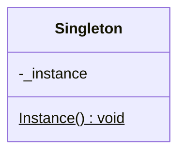

# Design Patterns: Singleton

A singleton is a class designed to only ever have on instance.
The class itself is responsible to ensuring this requirement.

Examples:

The pattern is usually used for shared resources e.g.
- access to the file system
- access to a shared network resource e.g. printer

or for performance reasons when it's expensive to run up an instance so it's better to just have a one-time configuration.
Also it's possible to only create an instance when a request for that thing is recieved - this is also known as lazy loading.

## Structure



Single class, private instance, with a public static method that allows you to access that instance.

## Features
Applications that use the singleton class have at anytime, only 0 or 1 instance of the class.

Singleton classes are created without parameters. If you need similar instances depending on some parameters check out the [factory pattern](factory.md)

Lazy instantiation as the default. This means that due to performance reasons singleton instances are not usually created unless something requests them.
Another appoarch is to create an instance at startup and to use that same instance for the life of the application.

In the code
Singleton classes should have a single, private, parameterless constructor.
Because of this subclassing isn't allowed.
To ensure this singleton classes should be marked as *sealed*

The only reference to the singleton should be in a private static field in the singleton class itself.

The rest of the application accesses the singleton via a public static method the classes exposes for this purpose.

## Examples

Here we will show using `Lazy<T>` to implement the singleton pattern.
This isn't the only way however to implement it. If you're interested on the approach of how to apply the singleton pattern and achieve a thread-safe solution each out [these examples](examples.md).

### Using `Lazy<T>`

Another way we can create a singleton us to use the `Lazy<T>` type
It provides built-in support for lazy initalization.
To create a `Lazy<T>` type you:
- specify the Type you're using
- specify a means of create the Type

Lets see how this is implemented.

```cs
public sealed class Singleton
{
    // reading this will initialize the instance
    private static readonly Lazy<Singleton> _lazy = new Lazy<Singleton>(() => new Singleton());

    private Singleton()
    {
    }

    public static Singleton Instance
    {
        get
        {
            return _lazy.Value;
        }
    }
}
```

We now have a field `_lazy` of type `Lazy<Singleton>`, this will create a new `Lazy<Singleton>`  at construction. And a lambda function is passed into the `Lazy<T>` constructor contaning the logic required to make a `Singleton` instance.

Only other point to note, we now return `_lazy.Value` in the `Instance` method. This is guarenteed to never be null, as this is a property of `Lazy<T>` and there will only be one instance of it since its coming from a static field.

This is probably the best approach because it has all the thread-safety features we want, as well as being simple and intuitive to understand.

## What problems does the singleton pattern solve?
Some people consider the singleton to be an antipattern for the following reasons:
- Direct static use in code (as opposed passing an interface they implement), leads to tight coupling and difficult to test code.
- Doesn't follow seperation of concerns
- Doesn't follow single responsibility principle - since it's managing it's instance life-time as well as whatever it's actual work is
- If you're going to implement more than one singleton you have to duplicate all the logic to get that behavior which violates the DRY princple
- There are alternative approachs that get the same result as the singleton.

## How is the singleton pattern structured?

## How do you apply the singleton pattern?

## Alternatives and related patterns

One alternative is to use static classes.
In C#, you can declare a class as static and the compiler ensures that the class defintion only contains static members.

Let's compare the differences between the singleton and a static class since they're quite similar and many people get them confused.

| Singleton | Static Class |
|----|---|
| Can implement interfaces (since it is an actual class) | No interfaces (since it's just a collection of static method and functions)|
| Can be passed as an arguement to method. Therefore, can be used in the strategy design pattern and dependency injection | Cannot be passed as arguements to methods|
| Can be assigned to variables | Cannot be assigned |
| Support polymorphism | Purely procedual |
| Can have a state | CAn only access global state|
| Can be serialized | Cannot be serialized |


<!-- TODO: Include part on IoC containers and whatnot -->


## Summary
- A singleton class is deigned to only ever have one instance created
- The singleton pattern makes the class itself responsible for enforcing Singleton behaviour
- It's easy to get the pattern wrong when implementing by hand
- `Lazy<T>` is one of the better ways of applying the pattern
- Singletons are different from static classes
- If your framework uses IOC/DI containers like in .NET applications, the they are usually a better place to manage instance lifetime