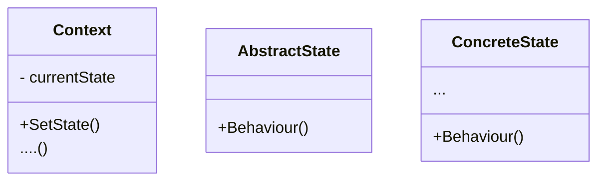
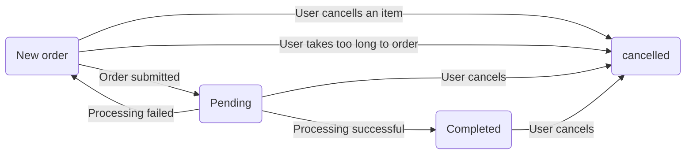

# State Design Pattern

## What is state?

> State is the condition of something variable (as in something changeable).

e.g states of matter, is something soid, liquid or gas.
Imagine ice, it's initally a solid, left out turned to liquid, heated up it'll turn to a gass

Questions of state in programming
Order for a shopping app
- Is this a new orde 
- Is it being process
- Has it been cancelled
- Has it been shipped?

And we make decisions based on the state like a user can't edit an order that's cancelled
Or a completed order cannot be cancelled 

## What this pattern addresses?
- How can an object change it's behavior when its internal state changes
- HOw cna state specific behaviours be defined so that states can be added without altering the behavior of existing states

Usyually when writing code we dont have a single place that contains the state to all the things were looking at.
This leads to:
- interdependent logic
- time lost managing fields
- difficult to extend
- harder to debug
- 

The state design pattern minimized conditional complexity.
Allowing you to manage state without the need for boolean fields and countless if statements.

The benefits being your coding being:
- more modular
- easier to maintain
- eaier to read
- easier to debug

## It addresses the challenges by

The state design pattern addresses the challenges by
- encapsulating state-specific behaviours within separate state objects
- A class then delegates the execution of it's state specific behaviors to one state at a time

## Elements of the state pattern 
- Context
  - Maintains an instance of a concrete state as the current state
- Abstract state
  - An abstract class that defines an interface which encapsulates all state-specific behaviors
- Concrete state (you can have multiple)
  - Subclass of the abstract state
  - Implements behaviours specific to a particular state of context

Her we have the context, the abstract state and a number of concrete states.
The concrete states derive from the abstract state, implementing the interfaces defined in it.
The context maintains a reference to one of the concrete states as its current state via the abstract base class.

It's not a complex structure but it does force a differnt approach to structuring your code.

To be able to use the state design pattern, you need to be able to:
- list possible states your object can be in
- the condition for trsnsitioning between these states
- the initial state of the object

## Example
Consider a system for buying clothes online

The possible states for an order would be:
- New order
- Cancelled 
- Pending
- Completed

Conditions for transitioning between states:

Recall from how the state design pattern addresses issues of state
it "delegates the execution of it's state-specific behaviours to one state object at a time"

Since a booking is in only one state at a time it means there's no need to check to see if it's in another state. Because it's simply not possible with this design.
Although this may first seem like a limitation, it is exactly this restriction that makes the state design pattern so powerful.
This allows developer to focus what should happen within a state without having to worry about how it'll affect other states.

