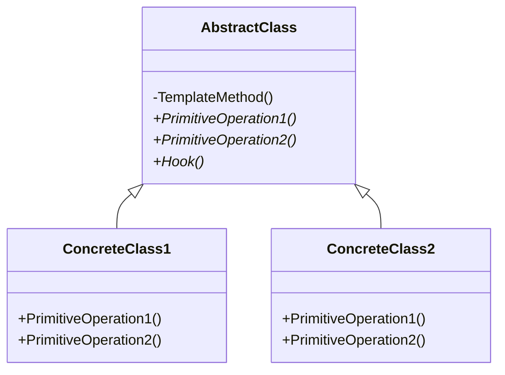

# Template Method C# Design Patterns

A template method is a method in a superclass that defines the skeleton of an operation in terms of higher level steps.

Subclasses implement these steps.

It's a way of locking in the steps and their order, whilst leaving the implementation details to the subclasses via inheritence.

The template method is known as a behavioural design patterm because it helps your to organise the behaviour of your application.
They're frequently used to remove duplication and improve extensibility.

> Template methods are fundamental technique for code reuse.
> - Design patterns, 1994 (gang of 4)


 # Examples of where you could use it.
 1. Say your building some games, you might find similar logic being duplicate for determining who wins.
 2. Following recipes - you might have similar steps that get repeated quite often 
 3. Lots of UI frameworks use the template method a lot.

 # What method does the Template Method solve?
 1. FOr locking down a process while allowing clients to alter certain steps in the process
 2. Generalise duplicate behaviour amoung methods in several classes - thus adhering to the [DRY principle](../../dry.md).
 3. When builing a framework, this is perfect for being able to create and controlling extension points for future code implementations.
 4. Simple cases where base functionality needs to be preserved.
    1. Child types can override virtual members of base types. WHen they do the new method is called instead of the base type.

# Example with simple inheritance

```cs
public abstract class Base
{
    public virtual void Execute()
    {
        ExecuteCommands();
    }
}

public class Child : Base
{
    public override void Execute()
    {
        base.Do();
        ExecuteDifferentCommands();
    }
}
```

Looking at this implementaion once of the key issues is that it's extremely easy to miss out calling `base.Do()` the issue with this is if you wanted to include the detaisl in the base class it's incredibily easy to miss out this line.
ANd clients that do so will be prone to errors.

Another good candiate for the template method is largely duplicate processes.

e.g.
| Import a file | Import from a database |
|---|---|
| Open file | Query table |
| Read a line | Read a row |
| Transform text into destination schema | Transform columns into destination schema |
| Insert row | Insert row |

## Example

Problems the template method can solve

<!-- Maybe just change the example above to the actual example -->

## Structure of the Design Pattern



The template method gets its name from having a non-virtual method in a parent or base class, that calls other virtual or abstract methods in the parent class.
The child classes can override the methods where they want to customise behavior but they can't touch the template method itself.
Some methods in the abstract base class might have a default implmentation or they could be empty and are soley provided as hooks for child classes and add additonational functionality.

It's not necessary for the base class to be abstract but it is a fairly common approach when you have many different concrete implentations.

## Working with the template method 
1. Inherit the class containing the method
2. Implement one or more of the specific virtual steps exposed by the base type
3. You don't implement or override the template method itself. Dont touch that
4. You can extend behaviour using hooks if available and needed
5. Writing code like this follows the [hollywood principle]
   <!-- TODO: Hollywood principle.md -->

   Hollywood principle states 
> Dont call us, we'll call you

Think about it like this.
When youre using the template method design pattern.
YOu dont call the template method.
Instead the template method class you when yoiu overriude the other methods that the template method calls.

Instewad of determining the control flow, you leave that for the template method to handle and you just provide it with the implementation details it needs to get those things done.

## HOw do you refactor to follow the template method?
Follow good refactoring techniques. o

Extract out the methods for the common steps.
Do this in two methods that share similar steps and try to have the methods match as closely as possible in terms of names and parameters.

If you have mutiple processes you think can be combined then start with just two of them.

Once the original has been simplified to the point where the original method i sjust calling other methods to perform the steps, pull it up into the base class.
This will be the template method - do NOT make it virtual.

Now create methods in the base class to make steps.
If they're identical between children move their implemention up into the base class.
If they vary maybe the base class abstract and have the child classes implement that abstract method.

Consider whether in the future you might need methods to add in additional functionality.
If so, you can add in additional virtual methods to the base class and make sure to call them from the appropriate place in the template method.
The implementation of these methods should do nothing by default.

<!-- TODO: Example code to show pattern, add in the code above somewhere to demonstrate the problem needed fixing -->


# Analysis
The new code has:
- less duplication
- better encapsulation 
  - Workflow is enforced by design and not just convention or documentation
  - developers adding variations cannot modify this workflow directly 
- Better exetensibility
  - It's easier to extend
  - Less error prone
  - Less work to do
  - Little way for developers to change the workflow
- Follows [open/closed principle](../../solid/solid_explained/ocp.md) because it means we can add functionality without modifying existing classes
- Follows hollywood principle because we dont call the template method. It calls us and our code in the child classes

All this means our design helps guide develops into the "pit of success" by making the right decision easy and the wrong decision hard.

## Related patterns
- [Factory method](factory.md"pit of success" by making the right decision easy and the wrong decision hard.

## Related patterns

### [Factory method](factory.md)
Is often called by the template method.
Frequently the result of the template method is a returned object and part of the process is usually to call a factory method in addition to other steps.

### [Stratgy pattern](strategy.md)
Allows you vary a whole algorithm by delegating it to a different class via composition.
The tempalte method encapsulates an algorithm but allows it to vary amoung its child classes via inheritence

Both methods help you write code that follows the [open/closed principle](../../solid/solid_explained/ocp.md)
and hollywood principle

### [Rules engine](rules.md)
The rule engine pattern frequently implemetns the template method pattern in its implemtnation.
Individual rule processing may follow a process defined in a base rule class and similarly the engine itself may inherit behaviour from a base rule engine class that defines how it should operate.

