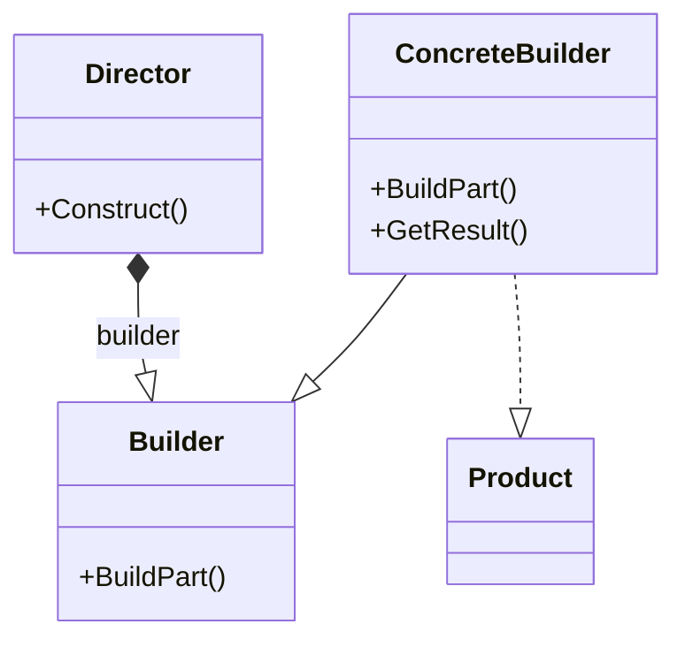

# Builder Design Pattern

The builder pattern is a creational design pattern.

Specifically, this pattern:
> "Separates the construction of a complex object frm its representation so that the same construction process casn create different representations.
> -Design patterns: Elements of Reusable Object Oriented Software.

More clearly, the builder pattern:
- Abstracts out initalisation code from the rest of the class and abstracts it out to an interfac
- Representations of this class are the concrete classes which have been constructed from the interface.
- The concrete classes don't deal with instantiating themselves, there's a director class that handles actual object creation. It controls where are with what data classes are created

## Diagram



Here we are wanting to create an instance of `Product`.
But as you can see from the diagram it has not initalisation logic.
Instead what we have is the following.
The builder is the inferface that defines how the pieces of the complex object are created.
The `ConcreteBuilder` this constructs the object according to the `Builder` interface.
Note, that each `ConcreteBuilder` class you have is reponsible for keeping track of the representation of the complex object it creates and retrieveing that object when queried.

The `Director` class handles the call to construct the complex object using the concrete builder

The builder design pattern is not  often seen in production code.
This is due to it's proper use cases not being all that common.

Key points
- Builder is useful when creating complex objects
- When object crreation needs to be separated from its assembly
- When different representions need to be created with finer control

## Example

Say we have a car dealership and we need to generate a report on the sales for the dealership.
The code would look something like

```cs
public class SalesReport
{
    public string HeaderSection;
    public string SalesSection;
    public string OfficeBreakdown;

    public string Debug()
    {
        return new StringBuilder()
            .AppendLine(HeaderSection)
            .AppendLine(SalesSection)
            .AppendLine(OfficeBreakdown)
            .ToString();
    }
}
```

Now we want to implement the builder desing pattern here.
First thing we are going to do is creata a builder interface.
```cs
public class ICarSalesReportBuilder()
{
    void AddHeader();
    void AddSales();
    void AddOfficeBreakdown();

    SalesReport GetSalesReport();
}
```

The whole point of the builder pattern is to separate out the objects construction from its representation. We want to keep this interface as general as we can so that it can be applied to different representations of the report e.g. weekly, monthly and quarterly reports.

We have included a `GetSalesReport()` method, this should return the report once it has been constructed.
Remember this is only an interface and the implementation of all these methods will happen in the concrete builder classes.

Also note that its not necessary for you to include a method to get the object in the builder interface.
If you have a more complex scenario, you can simply include a method like `GetSalesReport()` in each of your concrete classes.
Though do ensure that you've created it in every single one of your concrete classes.

Reflecting on what we've done here, see that we've broken up the construction of a sales report into mutilple steps.
This will allow us a finer control over the construction of the object in question.
This gives options for error handling or sequential computatation at each step of the way.

We now have everything we need to implement a concrete class for out daily sales report.

```cs
public class DailySalesReportBuilder: ISalesReportBuilder
{
    private SalesReport _report;

    public DailySalesReportBuilder()
    {
        Reset();
    }

    public void Reset()
    {
        _report = new SalesReport();
    }

    public void AddHeader()
    {
        // Here you would implement header method for this sales report
        return "----------------------SALES REPORT-----------------"
    }

    public void AddSales()
    {
        // Here you would implement the add method for this sales report.
        // Include all the sales data neede 
        
        return 
        """Sales Data:
        Total sales: ${}
        """
    }

    public void AddOfficeBreakdown()
    {
        return

    }

    public SalesReport GetSalesReport()
    {
        SalesReport finishedReport = _report;
        Reset();

        return finishedReport;
    }
}
```

Here weve'e implemented a `Reset` method, here we see that the report is instantiated with a new `SalesReport` object.
This isn't always implemented, but is key in this scenario as defensive programming.

We also execute the `Reset()` method in the constructor so we know we'll be working with a fresh report each time.

