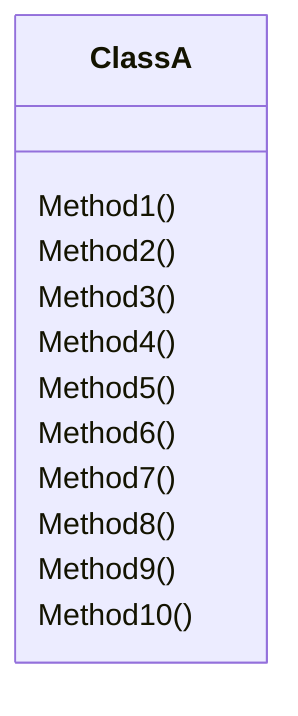
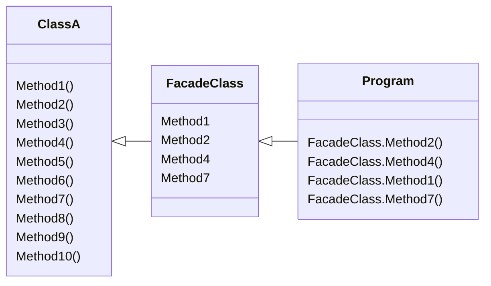

# C# Design Patterns: Facade

## Problems to solve

Consider the "big ball of mud" class, made famous by Martin Fowler.

Say you have a program that needs to call four methods from `ClassA`:
- `ClassA.Method2`
- `ClassA.Method4`
- `ClassA.Method1`
- `ClassA.Method7`

Now, to actually determine which we want we are likely going to have to examine and read through the internals of class A to figure out which methods we actually want.

This is where a facade comes in.
We can have a facade class that has a refence to `ClassA` and only exposes the methods needed by the program.

This means we couild use moe meaningful method names if we wanted, and our program now talks to the facade without knowing about the big `ClassA`.

## Second scenario

## The Facade Pattern
## Using Facade in practice