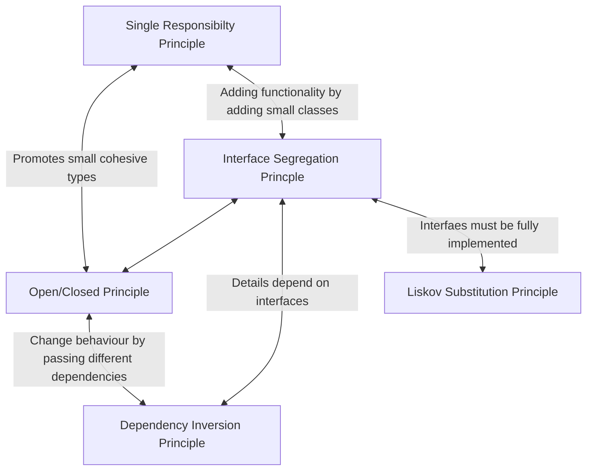

# Solid Design Principles

- [Single Responsibility Princple](solid_explained/srp.md)
- [Open/Closed Principle](solid_explained/ocp.md)
- [Liskov Substitution Principle](solid_explained/lsp.md)
- [Interface Segregation Princple](solid_explained/isp.md)
- [Dependency Inversion Principle](solid_explained/dip.md)


## Doesn't it lead to too many files?

Following SOLID design principles does result in smaller more focused classes and interfaces, which does lead to there being many files.

However, this doesn't necessarily have to be a problem if you use a strong (or solid even) organisational structure.

Instead of having everything in your root folder, organise your files into seperate folders.
Each file should be very specific in its task.
This means you should be able to group together files that similar functionality.

There are several ways of organising files.
One prevailing convention is to organise based on what a file is.
For example, all the controllers go into one folder, all the models into another, etc.
There might be one for interfaces and services.

Another approach especially useful as applications grow is to use feature-folders.
So each folder pertains to a certain feature.
This would mean that the top-level folder structure should be based on features as opposed to what each of the files does.
An online shop might have folders for catalog, search, basket, etc.
instead of controllers, models and services.
Folders are the simplest solution.

As a project gets more complex and you add new functionality it is advised you start to factor out your code into seperate projects.

## Examples

Say you have the following project

```
MyShopProject
| PriceCalculator.cs
| ConsoleLogger.cs
| DefaultBasket.cs
| EmailRecipt
| PostalRecipt
| ILogger.cs
| IRecipt.cs
| IBasketContext.cs
| IBasketUpdater.cs
| Program.cs
| ProductFactory.cs
| IProduct.cs
```

You can start by creating new folders
```
MyShoppingBasketProject
| Core // Contains all business logic that doesn't depend on other things, doesn't have dependencies on external concerns
    | Inferfaces
        | ILogger.cs
        | IRecipt.cs
        | IBasketContext.cs
    | Model
        | Recipt.cs
        | EmailRecipt.cs
        | PostalRecipt.cs
    BasketEngine.cs
| Infrastructure // for where things that have dependencies on specific implementation details

| UI // Entry point for the applicaiton
| PriceCalculator.cs
| ConsoleLogger.cs
| DefaultBasket.cs
| EmailRecipt
| PostalRecipt
| IBasketUpdater.cs
| Program.cs
| ProductFactory.cs
| IProduct.cs
| IProductContext.cs
| IProductUpdater.cs
| DefaultBasketContext.cs
| BasketUpdater.cs
```


Not how there are several files that don't fit into any of the other folders.
This might be an indication they're not actually used or are superfulous.
At this point you might want to checkout if those files are used elsewhere and if not then you might consider getting rid of them.

In this example they aren't used elsewhere so we can simply get rid of them.
Leaving us with a nice clean folder structore

## Review of solid princples



<!-- TODO: Need to finish diagram-->