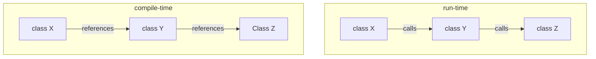
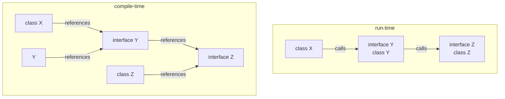

## The Dependency Inversion Principle

The principle:
> 1. Higher-level modules should not depend on low-level modules. Both should depend on abstractions.
> 2. Abstractions should not depend on details. Details should depend on abstractions.

Take the following example:
```csharp
internal class Cog
{
    int CogSize;
}

internal class Engine
{
    Cog cog;
}

class Train
{
    Engine engine;
}
```

This is an example that doesn't follow the principle. This is because the high-level class `Train` is tightly-coupled to `Engine`, and `Engine` is tightly-coupled to `Cog`. You can say that this a tightly coupled system, where the lower-level components are being used directly by the component above it - which violates point 1 above.

To explain this further, say we used the property `CogSize` in `Engine`. If we changed `Cog` so that it would have the properties `CogRadius` and `TeethSize` and removed `CogSize`. This would mean we'd have to refactor `Engine` to account for this. Hence showing how tightly-coupled it is.

We can get around this using interfaces between components instead of using the objects themselves.

```csharp
internal interface ICog
{
    int CogSize;
}

internal class Cog: ICog
{

}

internal interface IEngine
{

}

internal class Engine: IEngine
{
    ICog cog;
}

class Train
{
    IEngine engine
}
```
<!-- TODO: This whole explanation needs improving. Consider talking about abstractions to explain the interfaces part. -->
By introducing the interfaces there is no longer a dependency between the components i.e. they've been de-coupled.
We can see this because, we know if we make changes to `Cog` it wouldn't affact `Engine` because `Engine` knows that `cog` will always be of the type `ICog`. So now there isn't a dependency between the entities e.g. `Engine` and `Cog` instead it's between an entity `Engine` and an abstraction `ICog`.


-------------

## Dependency Inversion Principle

The principle:
> High-level modules should not depend on lower level-modules.
> Both should depend on abstractions.
> .
> Abstractions should not depend on details.
> Details should depend on abstractions.

How do you know if something is dependent on something else?

In C# we have the following types of dependencies:

- Compile-time
- Runtime

DIP is mostly concerned with compile time dependencies.

If your project is build using multiple projects in a solution,
your project references will point in the direction of your dependencies.

If you follow DIP, these dependencies should point away from your lowlevel infrastructure code and towards your abstractions and high-level abstractions and buisiness logic.

What's high-level and low level?

High-level refers to:
- constructs in our application that are more abstract
- They relate to the problem domain and our business goals.
- They're usually more process oriented than detail-oriented.
- futher away from input/output (I/O) like forms and buttons or files for databases.
  
Low-level refers to:
- things closer to I/O e.g. is this input coming frm a file or from the console or from a db table
- "plumbing code" helps connect business logic to the rest of the world and makes things work
- how yoyr application interacts with specific external systems and hardware.

DIP is all about [seperation of concerns](/soc.md)
We want to keep high-level concerns like domain model or business logic away from the low-level concerns like plumbing code.
The abstractions for your application are generally going to high-level concerns, so make sure they dont depend on low-level concerns.

What is an abstraction?

In C# they usually refer to:
- Interfaces
- Abstract base classes

Interfaces are slighly more prefered because they dont use object inheritance.
So they're a bit more flexible.

Things you can instantiate are concrete while their types that describe a way to work with that type are abstract.
Abstractions are just contracts outlining how to work with a type without actually specifiying how that functionality will actually work.

What are details?

- Abstractions shouldn't be coupled to details
- Abstracrions define what needs to happen e.g. send a message, store a record
- Details specify how things happen
  
Examples
| Abstraction | Details |
|---|---|
| Send a message | Send an SMTP email over port 64 |
| Store a order record | Add a row to the orders table with the correct foreign keys to various items |

The abstraction doesnt care about the abstraction it only cares if the thing gets done.

## Example of depending on details
```cs
pubic interface IOrderDataAccess
{
    SqlDataReader ListOrders(SqlParameterCollection params)
}
```

This interface is all about accessing order data.
Now you may look at this and this is a perfectly fine interface.

So what's wrong with it?

Recall "abstraction should not depend on details",
this interface depends on both `SqlDataReader` and `SqlParameterCollection`.
This actually exposes implementation details that our abstraction doesn't and shouldn't care about.
Futhermore, it makes the interface much less reusable. 
It also means any client that wants to use this interface must take a dependency on the package for `SqlDataReader` and `SqlParameterCollection`.

To fix this we intead want to use something like the following:
```cs
public interface IOrderAccess
{
    List<Order> ListOrders(Dictionary<string, string> params)
}
```

This now fixes the problem because the interface no longer depends on implementation details.
Structuring our interface like this also makes it more reusable since we are tied down to using exclusively `SqlDataReader` and `SqlParameterCollection`.


## Examples of low-level dependencies

- Database
- File system
- Email - sending or recieving
- Web apis - consumption or hosting
- configuration details - reading form a config file

# Hidden direct dependencies
 Need to look out for direct use of these low-level concerns from high-level concerns.

 They're usually come up in the following forms

- Direct use of low-level dependencies i.e using static calls or the `new` keyword being using to directly create instances of low-level types

These direct dependicies cause pain because they introduce tight-coupling.
Because they're these dependencies are hidden and now explicitly requested by the constructor of the class using them, they're more difficult to isolate and unit test.

Another thing to look for is when using these low-level types directly,
you're usually doing it over and over again,
leading to code duplication in the codebase.

# "New is Glue"

what does this mean?

Using `new` to create dependencies glues your code to that dependency.
It will tightly couple one class to another.

It's not that `new` is bad, your just need to be aware of the coupling it creates.
You should ask yourself do you need the specific implementation you're going to use?
Could you work with an abstraction instead and pass it in as a dependency.

## Explicity dependencies principle

States:
Classes should explicitly require their dependencies through their constructuor.

This eliminates suprises since clients can clearly see what the dependencies of a class are.

## Affect of abstraction on dependencies

Specifically how do dependencies vary between compile time and run time.

Let's look at what we have with no abstractions or interfaces first.



At compile time classes will reference classes they directly work with and instantiate. 
Then at run-time the class 



If we look at our diagram now we will see that actually `class X` no longer depends on class `class Y` and `class Y` no longer depends on `class Z`.
Instead all classes depend on the interfaces.

At runtime the behavior can remain the same with `ClassX` calling `ClassY` calling `ClassZ`.
But now instead of having tight-coupling between each of the classes we now have loose-coupling.
We've introduced several boundares which make testing much easier.
It also means it's much easier to switch out `classY` and `classZ` with a difffernt implementation in the future if we wanted to.

## Dependency Injection

DIP usually goes hand in hand with a technqiue known as dependency injection or DI for short. 

The explicit dependencies princple states you shouldn't create your down dependencies,
because this introduces tight coupling.
Instead, you should depend on abstraction and request them from client software.

Client code injects your classes dependencies ideally as constructor arguements, but you can use other ways such as properties and method arguements.

The dependency injection technique is an implementation of the [strategy design pattern](../../design_patterns/behavioural/strategy.md)

## Constructor dependency injection

It's strongly recommdended you use constructure dependency injection wherever you can for the followijng reasons (as oppousted to a property of method parameter)
- Follows explict dependencies principle by making client code aware of what dependencies a given class has.
- It ensurse classes are always in an initialised state. A class that requires a property to be set (i.e. that class would be uninitalised) is not nearly as initiive to work with and will require more checks in client code to ensure it's depenencies are set.
- its bset if services that have dependencies are immutable so that once created, oyou dont need to worry about if they stil have what they need in order to work.
- Constructor injection allows you to leverage an special factory types called IOC container or DI containers.
  You configure these containers to map between abstractions and implementation types and when your application runs the container is used to instantiate types that have dependencies.
  These container are able to resolve the dependencies at runtime providing a very flexible way of managing dependencies between your objects.

If you're using ASP.NET core it has a built-in services collection as its container.
You can use it directly or use a different third-party solution if you like.

## Example

COnsider we have the following class

```cs
public class CalculationEngine
{
    public ICalculationContext { get; set; } = new DefaultCalculationContext();
    
    public decimal Solution { get; set; }

    public CalculationEngine()
    {
        Context.Engine = this;
    }

    public void Calculate()
    {
        Context.Log("Starting calculation");

        Context.Log("Loading problem");

        string problemJson = Context.LoadPolicyFromFile();

        var string = Context.GetProblemFromJsonString(problemJson);

        var solution = Context.CalculateSolutionForProblem(problem, Context);

        solution.Calculate(problem);

        // More code

    }
}
```

As you can see from the above code there is a strong dependency between `CalculationEngine` and `ICalculationEngine` along with it's concrete implementation of `DefaultCalculationContext`.

In order to start refactoring this code we need to

<!-- TODO: Find a good example of impleemnting DIP -->

# Key takeaways:

- Most classes should depend on abstractions, not implementation details
- Abstractions shouldn't leak details, the shouldn't care about how they're implemented.
- Classes should be explicit about their dependendencies
- Clients should inject dependencies when they create other classes
- Structure your solution to leverage dependency inversion 