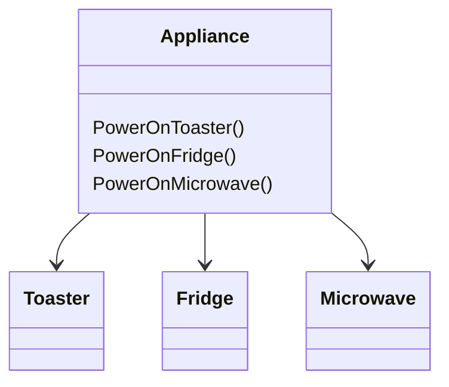
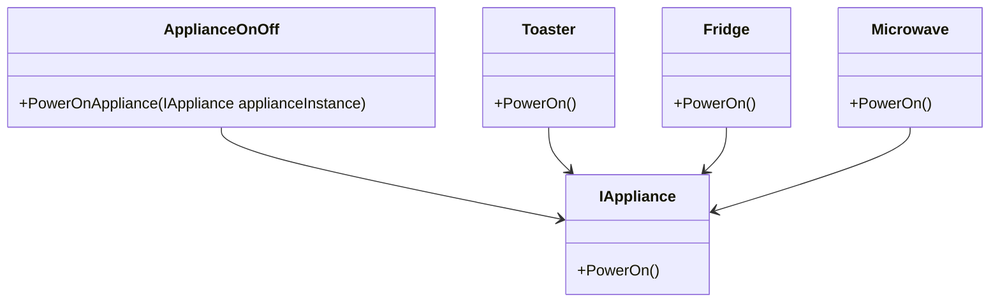

## Open/Closed Principle

The principle:
>Entities should be open for extension but closed for modifiction"

Aside: entities

Entities allow us to define an instance of an object which has a unique state and a common behaviour shared by all other object instances?

Say you have some code that completes a task.
You then have some new requirements.
Using the OCP it should be possible to make changes to the behavior of that code without needing to edit it's source code.
If you're wondering how this work 

### Example 



Here we see the `Appliance` class has three differenet power on methods for each of the different appliances. If we added a new appliance we'd also have to add another method to the `Appliance` class.

This violates the Open/Closed principle because when extending our system, we have made a modifiction - which is what we dont want! We want it "closed to modifiction".

So how do we fix this? Here's a redesign that doesn't violate the principle.



Here we can see that our system is now "closed" for modifications and "open" for extensions. Because if we add another appliance now, say a `WashingMachine` class. We don't have to change our interface or our `ApplianceOnOff` class - whereas before we would have had to make changes to the `Appliance` class in order to add a new appliance. Hence, our system was "open" for extension i.e adding a new appliance, but it was "closed" for modification i.e. we didn't need to modify our code in order to add this new appliance.

-------------------------------

## Open closed principle

> Entities should be open for extension but closed for modifiction

You should be able to add functionality to your code without having to edit or rewrite your source code.
Your code should be build such that, if there is a new requirement you simply need to add code to build on top of what's already there.

### What "open to extension means"?
New behaviour can be added in the future
If an application is closed to extension, it means that it has *fixed* behaviour - it cannot be changed

### What does "closed to modication" mean?
Changes to source code are not required.
The only way to change the behavior of the code is 

Code that is closed to extension, means that the only way that new behavior can be implemented is by changing the code itself - hence if code is "closed to extension" it is not "closed to modication".

### Why should code be closed to modification.
- If you dont change the code you're less likely to introduce bugs
- Not needing to change code means you don't have to redeploy it which saves on any downtime
- Reduces the risk of breaking dependent code
- Few conditionals in code that is open to extension which results in simplier code

Note: applying bug fixes to your code is okay. It's okay to apply bug fixes directly to the code, if there's not a better place to apply it. 

## Balance of Abrastration and Concreteness

It's easy to say to have your code open to extension. But what does this mean when we're actually coding?
The more abstract we get the more complex the system we're building becomes.
That's why it's import to understand and/or predict where variation is needed and apply abstraction as needed.

This is an example where the implementation is very concrete.
y

Another example of an extremely concrete class is:

```cs
public class SomeFunctionality
{
    public void DoSomething()
    {
        var doWhatever = new DoOnlyOneThing();
        doWhatever.DoIt();

        // rest of code
    }
}
```

This `new` keyword is cementing the type of implementation you're using here. It's forcing you to use the `DoOnlyOneThing` class - it's very concrete.

Alternatively, consider the other end of the spectrum, the extremely extensible code.

```cs
public class DoLiterallyAnything<TArg, TResult>
{
    private Func<TArg, TResult> _function;

    public DoLiterallyAnything(Func<TArg, TResult> function)
    {
        _function = function;
    }

    public TResult DoIt(TArg a)
    {
        return _function(a)
    }
}
```

This code can do literally anything, because it basically doesn't do anything. It simply has all of it's functionality passed into it.

While here it doesn't do much, parameterizing functionality is a key method in applying the OCP.

Another example is the following which relies on inheritance instead of composition

```cs
public abstract class DoWhatIWant<TResult, TArg>
{
    public abstract TResult DoIt(TArg a)
}
```

Since to be able to use this funcitonality, your code is expected to inherit from the `DoWhatIWant` abstract class.

## How do you predict future changes?

Easy start off concrete.
Then as time goes by and if you are required to make a modiciation, simply apply it directly.
However, if you're having to make more than one or two changes, and it's possible that further modifications might be possible.
Then it's time to consider making it open to extension, for that direction of changes.

## Typical approaches of OCP
- Parameters
- Inheritance
- Composition / injection (see dependency injection in dependency inversion)

Consider the example from before: (does only one thing)
```cs
public class DoesOnlyOneThing
{
    public void DoIt()
    {
        Console.WriteLine("Hello")
    }
}
```

We can apply the OCP in using the different ways above:

Parameter-based extension
```cs
public class DoesOnlyOneThing
{
    public void DoIt(string message)
    {
        Console.WriteLine(message)
    }
}

```

Inheritance-based extension 
```cs
public class DoesOnlyOneThing
{
    public virtual void DoIt()
    {
        Console.WriteLine("Hello world!")
    }
}


// This is a new child class
public class DoesSomethingElse: DoesOnlyOneThing
{
    public override void DoIt()
    {
        Console.WriteLine("Bye bye world!")
    }
}
```

Here we see that we have extensions the `DoesOnlyOneThing` class using inheritance. We have introduced a new subclass, which overrides the functionality of the `DoIt` method.
This is possible because we have set `DoIt` as a virtual method, which means it can be overriden.
And then in the subclass `DoesSomethingElse` we have overriden that method using the `override` keyword.

Finally, the composition-based extension

```cs
public class DoOnlyOneThing
{
    private readonly IPrintService _printService();

    public DoOnlyOneThing(IPrintService printService)
    {
        _printService = printService;
    }

    public void DoIt()
    {
        Console.WriteLine(_printService.GetMessage());
    }
}
```

Instead of having the message hardcoded in the `DoIt` method, we have now taken that out, and given that responsilbity to a class of type `IPrintService`.
The `DoIt` method, then uses an *instance* of this class to get the message that'll be printed to the console.
We could have simply have instantiated the service in the constructor i.e. somethind like `printService = new PrintService()`
But doing this would have then tied the `DoOnlyOneThing` class to a specific implementation of `IPrintService`.
This way you can have whatever implementation of `IPrintService` you like and simply pass it in.

# Working with Legacy Code
When working with legacy code it's better to create new classes, instead of adding to the existing legacy code which simply increases complexity.

The reasons for this?
1. You can designn the class to suit the problem. No need to work around existing code or bad patterns
2. Nothing depends on it. This give you the freedom to build the class as you wish
3. Add behaviour without touching existing code. Especially in large legacy applications touching existing code can be stressful since it can learn to unforeseen issues.
4. You can make sure your new class follows SRP (even if the code doesn't )
5. Build it so it's unit-testable