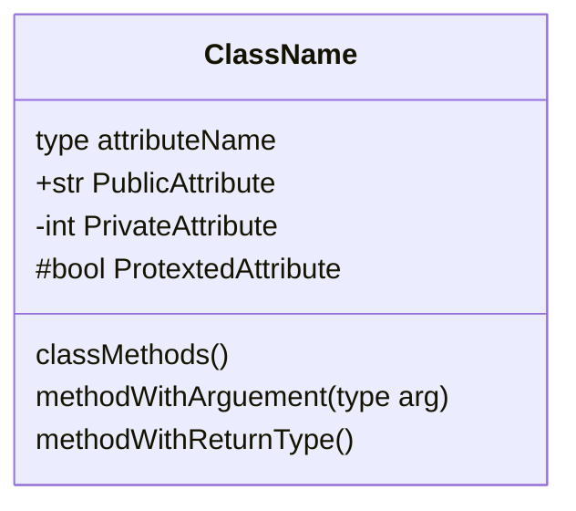

# Understanding class patterns

The basics

```mermaid
classDiagram
class ClassName
ClassName : type attributeName
ClassName : +str PublicAttribute
ClassName : -int PrivateAttribute
ClassName : #bool ProtextedAttribute
ClassName : classMethods()
ClassName : methodWithArguement(type arg)
ClassName : methodWithReturnType() 
```